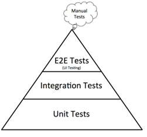
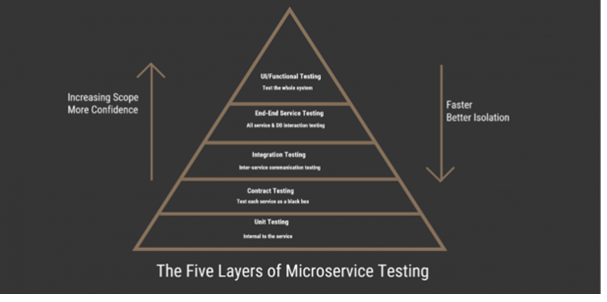

## QA Plan

Before releasing on [Amazon](https://amazon.com/), first of all, we ought to look at the test pyramid that is suitable for use and also types of testing we should do.
Let's discuss them.

## Test Pyramids

- Common Test Pyramid
  

    
  

- Micro Services Test Pyramid
  

    
  

## Testing Types

We also should consider many different types of testing before releasing:

- Unit Testing (H)
- Component Testing (H)
- Component Integration Testing/API Testing (H)
- Feature Testing/Functional Acceptance Testing (H)
- Smoke Testing (H)
- Regression Testing (H)
- Accessibility Testing (M)
- Exploratory Testing (H)
- Stress Testing (L)
- E2E Testing (H)
- Penetration Testing (M)
- Load Testing (H)
- Soak Testing (L)
- User Acceptance Testing/Beta Testing (H)
- Pre Prod Testing (M)
- Chaos Testing (L)
- RUM Testing (L)

(H):High Priority (M):Medium Priority (L):Low Priority

References:
[The different types of software testing by Atlassian](https://www.atlassian.com/continuous-delivery/software-testing/types-of-software-testing)

[Different Types of Testing in Software by Perfecto.io](https://www.perfecto.io/resources/types-of-testing)

## Test Environments

Make sure we have done testing in the different environments: dev, QA, UAT, etc

## CI/CD

We should have CI/CD in place before thinking about releasing software. The CI/CD should include some quality gates in terms of test coverage.

## Test Reports

Make sure test reports are generated from the test execution. Stakeholders could verify ACs against the test results.

## Documentation

Make sure all the documents are in place, such as Confluence pages, architect diagrams, incidents monitoring, the User Guide and above all, testing documents.

## Jira Tickets

Epic and Jira tickets for stories/tasks are closed, including any testing activities.

## Alerts Monitoring

Alerms monitoring has been considered. QA should also be involved in this activity.

## DevOps Tickets

DevOps tickets are created before. They may have to set up infrastrcture and environments for release. This should also include any testing related setup.

## Runbooks

We have runbooks in place to solve any production incidents. QA must be familiar with incident management.

## Final Reports

What is achieved, what is outstaging, and risk analysis on any issues
